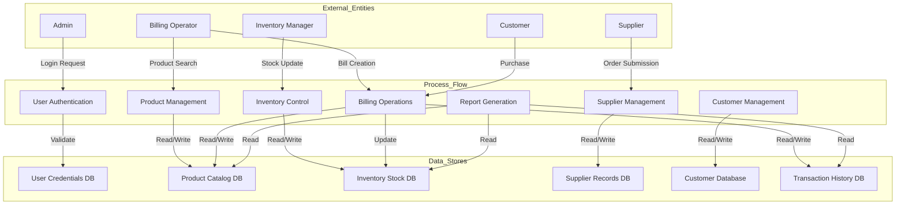
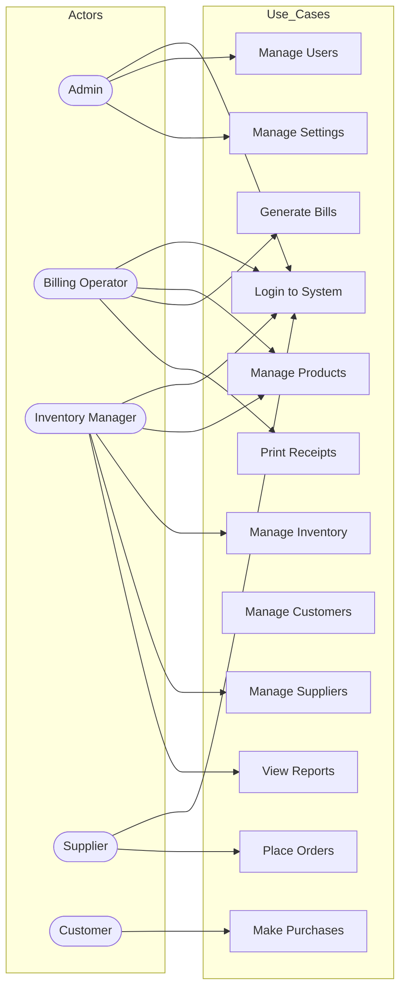
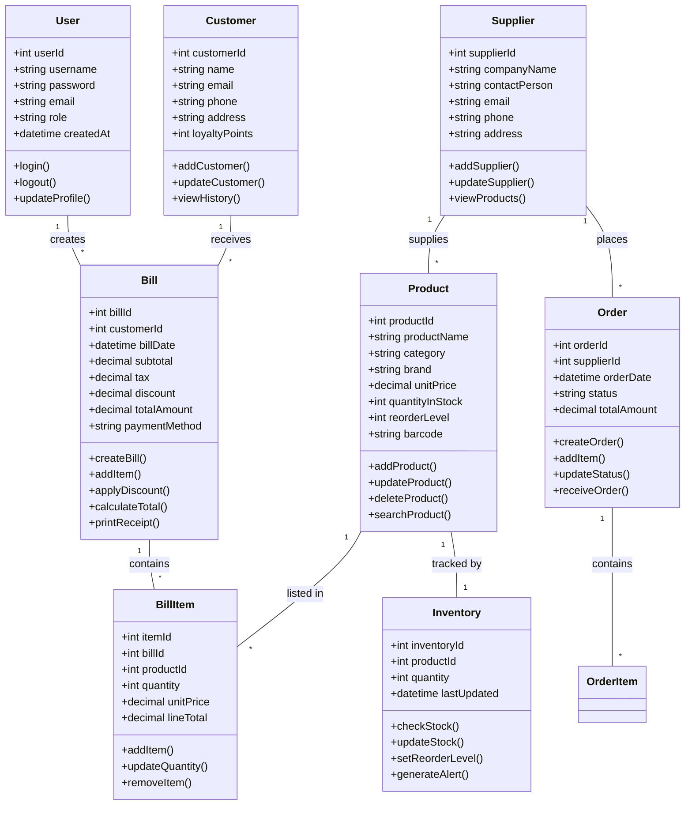
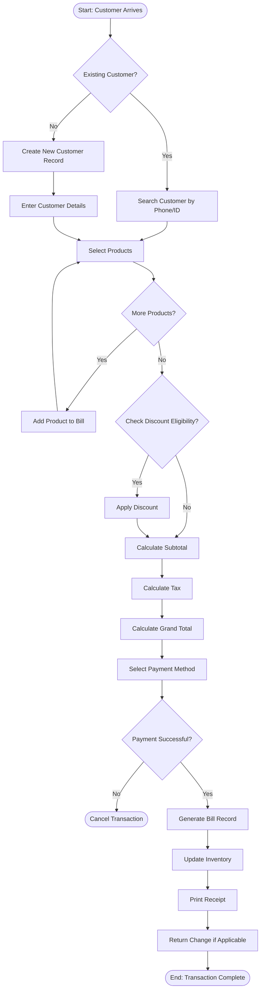
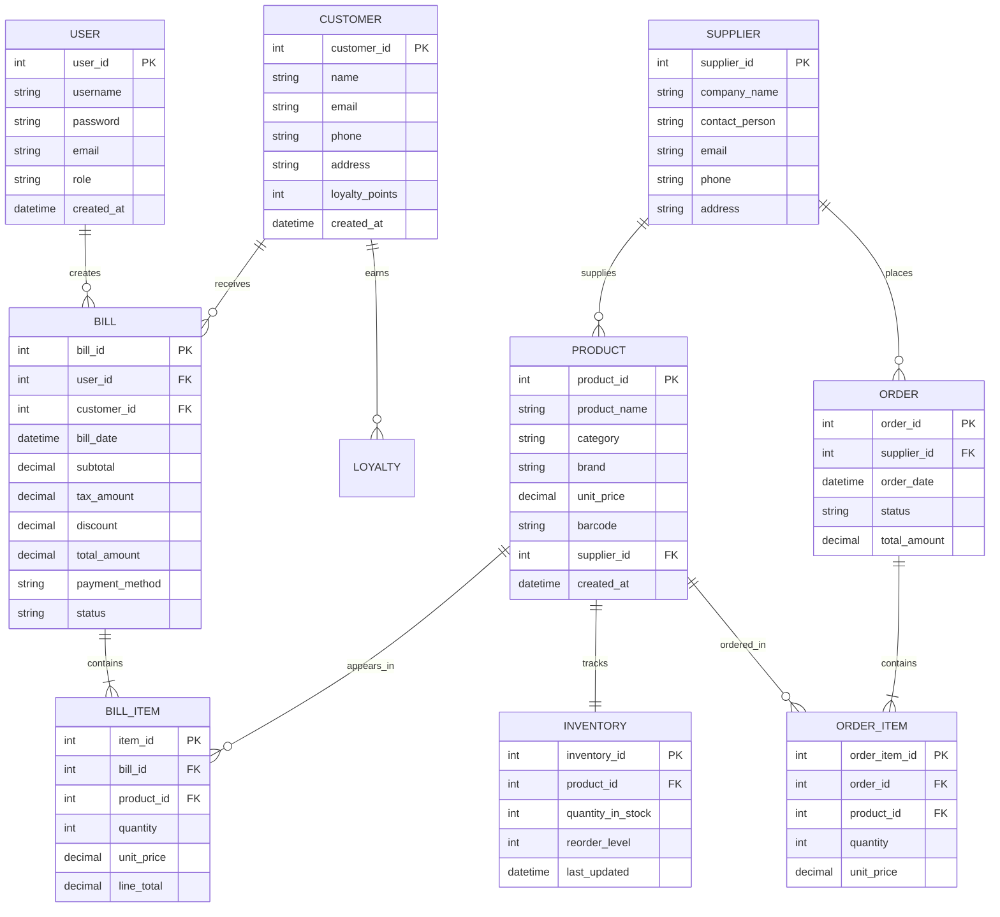
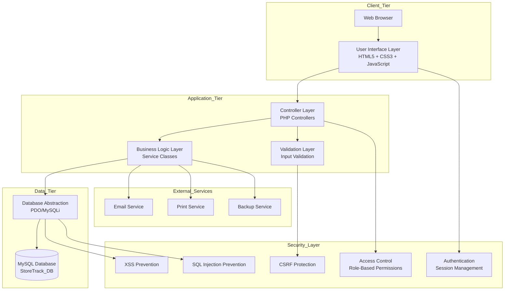

# Abstract

The rapid digitization of retail operations across small and medium-sized enterprises has created an unprecedented demand for efficient, reliable, and cost-effective store management solutions. Traditional methods of managing retail stores through manual ledgers, paper-based records, and disconnected spreadsheet applications have proven increasingly inadequate as business volumes grow and customer expectations intensify. These conventional approaches suffer from inherent limitations including high probability of human error, inability to provide real-time information, excessive time consumption for routine tasks, and significant vulnerability to data loss. The StoreTrack project, titled "Store Inventory and Billing Management System," addresses these critical challenges by developing a comprehensive web-based software application that automates and streamlines all fundamental aspects of retail store operations.

The proposed system provides a unified platform for managing product inventory, processing customer transactions, maintaining customer records, coordinating with suppliers, and generating analytical reports. Built using PHP as the server-side scripting language, MySQL as the database management system, and HTML5, CSS3, and JavaScript for the frontend interface, the application follows a three-tier architecture that ensures modularity, maintainability, and scalability. The system implements role-based access control to ensure that different users including administrators, billing operators, and inventory managers can access only the features appropriate to their responsibilities.

The primary objectives of the StoreTrack system include providing accurate and real-time visibility into stock levels, automating the generation of bills and receipts with precise calculations, maintaining comprehensive records of all business transactions, generating valuable reports for strategic decision-making, and significantly reducing the manual workload associated with routine store management tasks. The system supports features such as product categorization and barcode management, supplier information tracking, customer loyalty programs, automatic low-stock alerts, and configurable tax calculations.

Implementation of the StoreTrack system yields substantial benefits including elimination of manual paperwork, dramatic reduction in billing errors, improved customer service through faster transaction processing, enhanced inventory accuracy, and availability of reliable data for business analysis. The testing phase demonstrated that all critical functionalities operate correctly, with comprehensive test cases validating system behavior across various scenarios. This project represents a practical demonstration of applying software engineering principles to solve genuine business problems while fulfilling the academic requirements of the Bachelor of Computer Applications curriculum.

---

# Table of Contents

1. [Abstract](#abstract)
2. [Chapter 1 – Introduction](#chapter-1--introduction)
   - 1.1 Overview of the Project
   - 1.2 Purpose and Scope
   - 1.3 Background Information
3. [Chapter 2 – Problem Definition](#chapter-2--problem-definition)
   - 2.1 Real-World Problem Explanation
   - 2.2 Existing Challenges
   - 2.3 Need for Technical Solution
4. [Chapter 3 – Objectives of the Study](#chapter-3--objectives-of-the-study)
5. [Chapter 4 – System Analysis](#chapter-4--system-analysis)
   - 4.1 Existing System
   - 4.2 Proposed System
   - 4.3 Feasibility Study
   - 4.4 Requirement Specification
6. [Chapter 5 – System Design](#chapter-5--system-design)
   - 5.1 Data Flow Diagram
   - 5.2 Use Case Diagram
   - 5.3 Class Diagram
   - 5.4 Activity Diagram
   - 5.5 ER Diagram
   - 5.6 System Architecture Diagram
7. [Chapter 6 – Implementation](#chapter-6--implementation)
8. [Chapter 7 – Testing](#chapter-7--testing)
9. [Chapter 8 – Output Screenshots](#chapter-8--output-screenshots)
10. [Chapter 9 – Conclusion](#chapter-9--conclusion)
11. [Chapter 10 – Future Scope](#chapter-10--future-scope)
12. [Chapter 11 – Bibliography / References](#chapter-11--bibliography--references)
13. [Chapter 12 – Appendix](#chapter-12--appendix)

---

# Chapter 1 – Introduction

## 1.1 Overview of the Project

The StoreTrack system represents a significant technological advancement in retail store management, specifically designed to address the complex operational challenges encountered by small and medium-sized retail establishments. Retail stores form the backbone of India's commercial ecosystem, with millions of such establishments serving communities across urban and rural areas alike. These stores typically deal with hundreds to thousands of products, manage multiple suppliers, serve numerous customers daily, and must maintain accurate financial records for business sustainability and regulatory compliance. The effective management of these interconnected activities requires a systematic approach that manual methods simply cannot provide.

This project has been conceived and developed as part of the Bachelor of Computer Applications curriculum to demonstrate the practical application of software engineering principles to solve real-world business problems. The StoreTrack application serves as a comprehensive platform that integrates all aspects of retail store operations within a single, cohesive system. The application provides robust capabilities for product catalog management, enabling stores to maintain detailed information about all products including pricing, categorization, supplier associations, and stock levels. The inventory tracking module ensures that stock levels are accurately maintained and updated in real-time as products are received from suppliers or sold to customers.

The billing and invoicing module forms the point-of-sale interface where customer transactions are processed efficiently and accurately. This module generates professional receipts, applies appropriate discounts and taxes, and maintains complete transaction records for future reference and reporting. Customer relationship management features enable stores to build and maintain customer profiles, track purchase history, and implement loyalty programs that encourage customer retention. The reporting module generates various analytical reports including sales summaries, inventory valuations, and customer purchase patterns that provide valuable insights for business planning and decision-making.

The development of this application follows a structured software development lifecycle approach, beginning with detailed requirement analysis, proceeding through system design and implementation, and concluding with comprehensive testing and deployment preparation. Modern web technologies have been employed throughout to ensure that the application can be accessed through standard web browsers on any device with internet connectivity, eliminating the need for specialized software installation and enabling flexible deployment options.

## 1.2 Purpose and Scope

The primary purpose of the StoreTrack project is to develop a comprehensive computerized solution that completely transforms how retail stores manage their daily operations. The system aims to replace error-prone manual processes with accurate, automated digital workflows that significantly improve operational efficiency and data reliability. By providing a centralized platform for all store management activities, the system eliminates the fragmentation and inconsistency that plague traditional record-keeping approaches.

The scope of this project encompasses the complete range of core functionalities required for effective retail store management. In the domain of product management, the system provides complete CRUD (Create, Read, Update, Delete) operations for product records, supporting features such as product categorization, barcode management, image storage, and comprehensive search capabilities. The inventory management scope includes real-time stock tracking, automatic reorder level alerts, inventory valuation calculations, and physical stock count support for periodic verification exercises.

Customer management functionality within scope includes customer profile creation and maintenance, purchase history tracking, loyalty point management, and customer segmentation capabilities. Supplier management features enable stores to maintain comprehensive supplier records, track purchase orders, and analyze supplier performance over time. The billing module handles complete transaction processing including product selection, price calculation, discount application, tax computation, and receipt generation.

The scope specifically excludes certain advanced features that would be appropriate for larger enterprise deployments but are beyond the requirements of this academic project. These exclusions include multi-store or franchise management, integration with external payment gateways, e-commerce website synchronization, and advanced predictive analytics. These limitations help maintain focus on delivering high-quality core functionality within the project constraints while providing a foundation for future enhancement.

## 1.3 Background Information

The evolution of inventory management systems traces its origins to the early days of computing when large organizations first recognized the potential for using computers to track and manage their inventory holdings. In the 1960s and 1970s, early inventory management systems were developed for mainframe computers, primarily serving large manufacturing and distribution companies that could afford the substantial costs of computing infrastructure. These early systems focused on basic inventory tracking and reorder point calculations, laying the foundation for more sophisticated solutions that would emerge later.

The democratization of computing technology throughout the 1980s and 1990s brought inventory management capabilities to a broader range of organizations. Point-of-sale systems emerged during this period, combining transaction processing with inventory deduction to provide more integrated solutions for retail environments. The development of personal computers and local area networks enabled smaller businesses to adopt computerized management systems, though the costs and technical complexity still limited widespread adoption among small retailers.

The internet revolution of the late 1990s and early 2000s fundamentally transformed the landscape for business applications. Web-based architectures enabled the deployment of management systems without requiring complex client software installation, dramatically reducing deployment and maintenance costs. Cloud computing concepts emerged in the mid-2000s, further reducing the infrastructure requirements and technical expertise needed to deploy sophisticated business applications. These technological advances have made it economically and technically feasible to deploy enterprise-grade management solutions even for small neighborhood stores.

In the Indian context, the retail sector has undergone significant transformation over the past two decades. While large retail chains have rapidly adopted modern management technologies, the vast majority of small and medium-sized retail stores continue to rely on traditional methods. This technology gap presents both a challenge and an opportunity. The challenge lies in the operational inefficiencies and competitive disadvantages that these stores face. The opportunity lies in the potential for affordable, easy-to-use software solutions that can bring modernization to this underserved segment of the retail ecosystem.

---

# Chapter 2 – Problem Definition

## 2.1 Real-World Problem Explanation

Small and medium-sized retail stores in India face a multitude of interconnected challenges that directly impact their operational efficiency, profitability, and ability to compete effectively in the marketplace. The traditional approach to store management, characterized by manual record-keeping using paper registers and disconnected spreadsheets, creates a complex web of inefficiencies that compound over time and severely limit business growth potential.

The most fundamental problem lies in the area of inventory management. In a typical retail store, inventory may consist of hundreds to thousands of distinct products across multiple categories. Maintaining accurate records of all these products, including their quantities, prices, suppliers, and locations within the store, represents a significant administrative burden. When inventory management relies on manual methods, stock records quickly become inaccurate as small discrepancies accumulate with each transaction. Products are frequently lost to theft, damage, or simple misplacement without any mechanism to detect these losses promptly.

The billing and point-of-sale process in traditional stores is similarly problematic. Sales staff must manually calculate prices for each item, add up totals, apply any applicable discounts, calculate taxes, and arrive at the final amount payable. This process is time-consuming, especially when customers have numerous items or when complex discount schemes are in effect. The manual calculation process is highly susceptible to errors, with even small mistakes potentially resulting in revenue loss or customer dissatisfaction. During peak business hours, the slow processing speed creates long queues that frustrate customers and limit the store's capacity to serve more customers.

Supplier management presents another significant challenge that is often overlooked in traditional store operations. Stores typically work with multiple suppliers to maintain their product inventory, each with different pricing, delivery schedules, and terms of business. Without a systematic approach to supplier management, stores may miss opportunities for better pricing, experience delays in receiving ordered products, or face cash flow problems due to undisciplined payment schedules. The lack of organized purchase order tracking means that deliveries may be incomplete or incorrect without any mechanism for accountability.

## 2.2 Existing Challenges

The challenges faced by retail stores using traditional management methods can be categorized into several interconnected problem areas that collectively create a significant barrier to operational excellence and business growth. Understanding these challenges in detail is essential for appreciating the value that a computerized solution like StoreTrack can provide.

Data accuracy and reliability represent perhaps the most critical challenge in traditional store management. Human error is inherent in any manual data entry process, and when multiplied across hundreds of daily transactions, these small errors accumulate into significant discrepancies. Studies have shown that manual inventory systems typically have error rates of several percent, meaning that a store with ten thousand items in stock might have hundreds of items with incorrect records. These inaccuracies lead to stockouts of products that are actually available, overstocking of items that appear to be running low, and incorrect financial records that misrepresent the true state of the business.

Time inefficiency manifests in multiple forms throughout traditional store operations. Searching for specific product information requires physically scanning through pages of records. Generating reports requires aggregating data from multiple sources and performing calculations manually, a process that can take hours and is rarely performed frequently as a result. Administrative tasks that could be completed in seconds with a computerized system often require minutes or even hours with manual methods. This time could be better utilized in customer service, business development, and other value-adding activities that actually grow the business.

The absence of real-time information availability severely limits management's ability to make informed decisions. Store owners and managers typically lack visibility into critical business metrics such as current stock levels, fast-moving products, customer purchasing patterns, and profitability analysis. Decision-making becomes reactive rather than proactive, with problems often being identified only after they have already impacted business operations. A stockout, for example, is typically discovered only when a customer requests a product that is not available, resulting in an immediate lost sale and potential long-term damage to customer relationships.

Data security and backup represent additional challenges that are often underestimated until a crisis occurs. Paper records are vulnerable to loss from fire, water damage, theft, or simple misplacement. The physical records that document years of business transactions can be destroyed in moments by a single unfortunate event. Furthermore, maintaining physical records requires significant storage space and organizational effort to ensure that records can be retrieved when needed. Many stores simply do not maintain adequate backup procedures, leaving them vulnerable to permanent data loss.

## 2.3 Need for Technical Solution

The comprehensive analysis of challenges in traditional retail store management clearly demonstrates the compelling need for a technical solution that can address these problems systematically and effectively. A computerized management system offers fundamental advantages that directly tackle the root causes of operational inefficiency and data inaccuracy that plague traditional approaches.

The first and most important benefit of a technical solution is the elimination of manual data entry errors through automation. When calculations are performed by computer systems rather than human beings, the probability of arithmetic errors drops to essentially zero. Input validation rules can prevent obviously incorrect data from entering the system in the first place. The system maintains a single source of truth that is automatically updated with every transaction, ensuring that all users see the same accurate information.

Speed and efficiency improvements from a computerized system are dramatic and pervasive. Tasks that previously took hours can be completed in seconds. Product searches that required scanning through pages of records can be accomplished through instant database queries. Reports that required days of manual preparation can be generated automatically at the click of a button. These efficiency gains translate directly into cost savings through reduced labor requirements and improved throughput during peak business hours.

The availability of real-time information transforms management decision-making from reactive to proactive. With accurate, current data always at hand, store managers can identify problems before they escalate, spot opportunities as they emerge, and make evidence-based decisions rather than relying on intuition or guesswork. Automatic alerts can notify management when stock levels fall below thresholds, when unusual patterns emerge, or when action is required on any front.

From an academic perspective, this project provides an excellent opportunity to apply the theoretical knowledge gained throughout the Bachelor of Computer Applications curriculum to develop a practical, working software solution. The project encompasses requirements analysis, system design, database modeling, programming, testing, and documentation, providing comprehensive exposure to all phases of the software development lifecycle.

---

# Chapter 3 – Objectives of the Study

The StoreTrack project has been undertaken with clearly defined objectives that address specific needs in retail store management while fulfilling the academic requirements of the Bachelor of Computer Applications curriculum. Each objective has been carefully formulated to ensure that the project delivers both practical value and demonstrates technical competence.

1. **To develop a computerized inventory management system:** Create a robust software application capable of maintaining accurate records of all products in the store, including details such as product name, category, brand, unit price, quantity in stock, reorder level, and supplier information. The system shall enable easy addition, modification, and deletion of product records while maintaining data integrity through appropriate validation rules and database constraints.

2. **To automate the billing and invoicing process:** Implement a streamlined billing module that generates accurate bills for customer purchases, automatically calculates product prices based on current catalog data, applies applicable discounts and promotions, computes taxes according to configurable rules, and produces professional receipts that can be printed or emailed to customers.

3. **To maintain comprehensive customer records:** Establish and maintain detailed customer profiles including contact information such as name, address, phone number, and email address. The system shall track purchase history for each customer, manage loyalty points according to configurable rules, and support customer segmentation for targeted marketing activities.

4. **To generate valuable business reports:** Develop reporting capabilities that produce meaningful insights into business performance including sales reports showing revenue trends over configurable time periods, inventory valuation reports for financial accounting, customer purchase pattern analytics, and supplier performance metrics. Reports shall be available in both on-screen and exportable formats.

5. **To track supplier information and purchase orders:** Maintain systematic records of all suppliers including their contact details, products they supply, pricing agreements, and order history. The system shall support purchase order generation and tracking to ensure timely replenishment of inventory, with the ability to generate purchase recommendations based on current stock levels and historical sales.

6. **To reduce manual workload and eliminate paperwork:** Significantly reduce the time and effort required for routine administrative tasks by automating data entry, calculations, and record-keeping. Store employees shall be able to complete their work more efficiently with fewer errors, freeing their time for customer service and other value-adding activities.

7. **To improve data accuracy and reliability:** Ensure that all data entered into the system is validated appropriately to prevent obviously incorrect entries. Calculations shall be performed automatically by the system, eliminating arithmetic errors. The system shall maintain complete audit trails of all changes to critical records, providing accountability and traceability.

8. **To provide real-time inventory visibility:** Enable store managers to view current stock levels for all products at any time, identify items requiring reorder through automatic alert mechanisms, and track inventory movements including receipts, sales, and adjustments. This visibility shall support proactive inventory management that prevents both stockouts and overstocking.

9. **To demonstrate software development proficiency:** Successfully apply the software engineering principles, programming skills, database concepts, and system analysis techniques learned throughout the BCA course to develop a complete, functional software application that addresses a real-world business problem.

---

# Chapter 4 – System Analysis

## 4.1 Existing System

The existing system in most small and medium-sized retail stores relies entirely on manual processes and paper-based record-keeping that has remained largely unchanged for generations. This section provides a comprehensive analysis of how these stores currently operate, the limitations they face, and the risks associated with traditional approaches.

### Working Method

In the traditional retail store environment, inventory management begins with the receipt of goods from suppliers. Store staff manually record incoming products in ledger books, noting details such as product name, quantity received, purchase price, and date of receipt. Each product category may have its own register or section within a register, requiring staff to maintain multiple record books simultaneously. When products are sold, the quantity sold is subtracted from the ledger manually, and the selling price is recorded in a separate sales register along with customer information if available. At the end of each day, totals are calculated manually for reconciliation purposes.

Billing operations in traditional stores are performed using mechanical cash registers or simple calculators. Salespersons calculate the total by multiplying each product's price by its quantity, add up all items, apply any discounts manually, calculate tax amounts based on applicable rates, and arrive at the final amount payable. The receipt, if any, is typically handwritten on pre-printed receipt books or printed on simple receipt printers that capture only basic transaction information. Customer records, when maintained at all, are often kept in paper files organized alphabetically by customer name or by customer identification numbers assigned manually.

Supplier management involves maintaining physical files for each supplier containing contact information, price lists, and correspondence related to orders and deliveries. Purchase orders are prepared manually on paper forms, with copies retained for reference. Delivery schedules are tracked through diary entries or postings on notice boards within the store. Financial accounting, if any systematic accounting is maintained, is done in separate accounting registers with income and expense entries recorded by hand.

### Limitations

The manual system suffers from numerous fundamental limitations that directly impact business efficiency and profitability. The most significant limitation is the extremely high probability of human error in all calculations and data entries. A misplaced decimal point, an illegible figure, or a simple arithmetic mistake can cascade into significant record discrepancies over time. These errors often go undetected until periodic physical stock counts reveal discrepancies, by which time identifying the source of the problem becomes nearly impossible. The cumulative effect of these small errors can result in inventory records that differ from actual stock levels by substantial margins.

The system provides absolutely no built-in validation or cross-checks to prevent mistakes. There is no mechanism to alert staff when stock levels fall below reorder points, when duplicate entries are made accidentally, or when suspicious transactions occur. The absence of automated alerts means that inventory problems are often discovered only after they have already impacted business operations, sometimes resulting in lost sales or customer dissatisfaction. Staff must constantly monitor multiple records manually to catch issues, a task that is both time-consuming and error-prone.

Search and retrieval operations in paper-based systems are extraordinarily time-consuming and frustrating. Finding information about a specific product, customer, or transaction may require manually scanning through pages of records, often in multiple registers. Historical data that would be valuable for business analysis is practically inaccessible except through laborious manual compilation. This data inaccessibility prevents store owners from gaining insights that could improve their business operations.

### Risks and Inefficiencies

The manual system exposes the business to severe risks including data loss due to fire, water damage, theft, or simple misplacement of records. Physical records are vulnerable to deterioration over time and may become illegible, making historical data retrieval difficult or impossible. The complete absence of systematic backup mechanisms means that a single unfortunate event could result in the permanent loss of years of carefully maintained business records, with devastating consequences for the business.

Inefficiency in the manual system manifests as excessive time spent on routine administrative tasks that could be completely automated. Staff spend significant portions of their workday on data entry, calculations, and record-keeping activities rather than on customer service or other value-adding functions that actually grow the business. The slow processing speed creates bottlenecks during peak business hours, leading to long customer queues, frustration, and potential loss of sales as customers leave without making purchases.

The lack of integration between different aspects of store operations prevents holistic management and optimization. Sales data, inventory data, and financial data are maintained in separate silos with no mechanism for cross-referencing or consolidated analysis. This fragmentation makes it impossible to gain a comprehensive view of business performance or to identify correlations and patterns that could inform strategic decisions.

## 4.2 Proposed System

The proposed StoreTrack system represents a complete transformation from manual, paper-based operations to a modern, computerized management approach. This section describes how the new system will work, the advantages it offers, and how it resolves the problems identified in the existing system.

### System Workflow

The StoreTrack system operates as a web-based application accessible through standard web browsers on computers, tablets, or smartphones. Upon accessing the system, users are presented with a secure login screen where they must authenticate using their assigned username and password credentials. Successful authentication grants access to role-appropriate features through the main dashboard, which provides an immediate overview of key business metrics.

The dashboard displays real-time information including today's sales total, number of transactions completed, inventory items requiring attention due to low stock levels, and pending purchase orders awaiting delivery. The navigation menu provides clear access to all system modules including Product Management, Inventory Control, Supplier Management, Customer Management, Billing, Reports, and System Administration. Each module presents a user-friendly interface with clearly labeled buttons, intuitive forms, and well-organized data tables.

In the billing workflow, when a customer arrives for checkout, the billing operator searches for products by name, category, or barcode scanner input and adds them to the current bill. The system automatically displays product details and current prices, calculates line totals for each item, applies any applicable discounts, computes taxes according to configured rates, and shows the running total and final amount payable. Upon completion of the transaction, the system generates a numbered receipt, updates inventory records automatically, and records the complete transaction in the database.

### Advantages

The proposed system offers numerous compelling advantages over the existing manual approach. Speed is perhaps the most immediately noticeable benefit, with billing operations that previously took minutes now completing in seconds. Automated calculations eliminate errors and ensure perfect consistency across all transactions. The system provides instant access to information that previously required time-consuming manual searches through multiple registers.

Data accuracy is significantly improved through built-in validation rules that prevent obviously invalid data entry. The system maintains complete audit trails of all changes made to records, enabling accountability and making it easy to trace any discrepancies. Integrated reporting capabilities make it effortless to generate comprehensive business reports that would be impractical to produce manually, freeing management time for strategic activities.

The system provides real-time visibility into all aspects of store operations. Managers can monitor sales performance, track inventory levels, and identify trends as they happen rather than discovering them days or weeks later. Alert mechanisms automatically notify relevant personnel when action is needed, such as when stock falls below defined reorder levels. This proactive approach prevents problems before they impact customers or the bottom line.

### Problem Resolution

The proposed system addresses the specific problems identified in the existing system comprehensively and systematically. Data accuracy issues are completely resolved through automated calculations, input validation, and elimination of manual data transcription. The system provides multiple checkpoints and verification mechanisms to catch any errors before they propagate and cause problems. Mathematical accuracy is guaranteed through computer-based calculation, eliminating the root cause of many discrepancies.

Time inefficiency is addressed decisively by automating routine tasks, providing instant search and retrieval capabilities, and streamlining workflows throughout the system. The intuitive user interface requires minimal training, enabling even users with limited computer experience to become proficient quickly. Batch processing capabilities handle large volumes of data entry efficiently when needed.

The risks associated with paper-based systems are completely eliminated through electronic data storage with automatic backup capabilities. The centralized database ensures data consistency and provides a single source of truth for all business information. Even if hardware fails, data can be restored from backups with minimal disruption to operations.

## 4.3 Feasibility Study

A comprehensive feasibility study was conducted to evaluate the viability of the StoreTrack project from technical, economic, and operational perspectives. This analysis ensures that the project is not only technically sound but also practical to implement and beneficial to deploy.

### Technical Feasibility

The project is highly feasible from a technical standpoint. The development environment consists of widely-used, mature technologies that are well-documented and supported by large global communities. PHP, the server-side language chosen for this project, has been in continuous development for over two decades and provides robust, proven capabilities for web application development. MySQL, as a relational database management system, offers reliable data storage and retrieval with excellent performance characteristics suitable for applications of this scale.

The frontend technologies including HTML5, CSS3, and JavaScript are universally supported by all modern web browsers, ensuring that the application can be accessed from any device with a web browser. The web-based architecture means that the application does not require installation on client machines, dramatically simplifying deployment and ongoing maintenance. Updates and fixes can be deployed centrally without requiring any changes to client computers.

Hardware requirements for hosting the application are modest and can be met with basic server infrastructure or even a standard personal computer for smaller single-store deployments. The development tools required, including code editors, web browsers, and local development servers, are freely available as open-source software, eliminating any cost barriers to development.

### Economic Feasibility

The economic feasibility of the project is highly favorable given the significant return on investment it offers. The direct costs of development include primarily the time invested by the development team, which fulfills academic requirements anyway, plus minimal costs for development tools and deployment infrastructure. Many of the required tools are freely available as open-source software, and cloud hosting services offer highly affordable plans suitable for small business deployments.

The benefits in terms of operational efficiency translate directly into substantial cost savings for the business over time. Reduced labor requirements for routine administrative tasks free staff to focus on customer service and other value-adding activities. Elimination of errors that result in financial losses improves the bottom line directly. Improved inventory management prevents both stockouts that lose sales and overstocking that ties up capital unnecessarily.

The project represents an extremely cost-effective solution compared to commercial software alternatives, which often come with expensive licensing fees, ongoing maintenance costs, and potentially unnecessary features that add complexity without adding value. The proposed system is customized exactly to match the requirements of the target users, providing optimal functionality without paying for capabilities that will never be used.

### Operational Feasibility

The operational feasibility of the proposed system is very strong due to several supporting factors. The user interface has been designed from the ground up with simplicity and usability as primary considerations, ensuring that users with minimal computer experience can quickly learn to operate the system effectively. The familiar web-based interface reduces the learning curve for users who regularly browse the internet.

The system's functionality directly addresses the genuine needs and pain points experienced by store operators in their daily work. By automating tedious manual tasks and providing helpful features like stock alerts and quick search, the system genuinely makes users' jobs easier rather than adding complexity. This user-centric approach ensures high acceptance and adoption rates among store staff, which is critical for successful deployment.

Training requirements are minimal due to the intuitive interface design and the availability of contextual help within the application. User documentation including detailed manuals and quick reference guides can be developed as part of the project to support ongoing usage. The ongoing maintenance requirements of the system are modest, with routine tasks such as database backups and periodic updates being straightforward to implement.

## 4.4 Requirement Specification

The requirement specification defines the hardware and software infrastructure necessary to develop, deploy, and operate the StoreTrack system effectively.

### Hardware Requirements

The following table specifies the hardware components required for both development and deployment of the StoreTrack system:

| Hardware Component | Development Requirements | Deployment Requirements |
|-------------------|-------------------------|------------------------|
| Processor | Intel Core i3 or equivalent | Intel Core i5 or equivalent |
| RAM | 4 GB minimum | 8 GB recommended |
| Storage | 100 GB free space | 250 GB minimum |
| Display | 1024x768 resolution | 1280x720 resolution |
| Input Devices | Standard keyboard and mouse | Keyboard, Mouse, Barcode Scanner |
| Network | Internet connection | Broadband connection |
| Server | Local development server | Web hosting or local server |

### Software Requirements

The following table specifies the software components required for development and deployment:

| Software Component | Development Requirements | Deployment Requirements |
|------------------|-------------------------|------------------------|
| Operating System | Windows 10/11, Linux, macOS | Windows Server or Linux Server |
| Web Server | Apache with XAMPP/WAMP | Apache or Nginx |
| Database | MySQL 5.7+ | MySQL 5.7+ |
| Runtime | PHP 7.4+ | PHP 7.4+ |
| Browser | Chrome, Firefox, Edge | Chrome, Firefox, Edge, Safari |
| IDE | VS Code, Sublime Text, or similar | N/A for deployment |

---

# Chapter 5 – System Design

## 5.1 Data Flow Diagram (DFD)

The Data Flow Diagram illustrates how data moves through the StoreTrack system, showing the processes that transform data, the external entities that interact with the system, and the data stores that persist information.



## 5.2 Use Case Diagram

The Use Case Diagram shows the various actors that interact with the StoreTrack system and the different actions they can perform within the system.



## 5.3 Class Diagram

The Class Diagram represents the main classes in the StoreTrack system, their attributes, methods, and relationships between them.



## 5.4 Activity Diagram

The Activity Diagram illustrates the workflow for the billing process in the StoreTrack system, showing the sequence of activities and decision points.



## 5.5 ER Diagram

The Entity-Relationship Diagram represents the database structure of the StoreTrack system, showing entities, attributes, and relationships between them.



## 5.6 System Architecture Diagram

The System Architecture Diagram illustrates the overall structure of the StoreTrack application, showing the different layers and components.



---

# Chapter 6 – Implementation

## 6.1 Module-Wise Implementation

The StoreTrack system has been implemented as a modular web application with distinct functional modules that work together to provide comprehensive store management capabilities. Each module addresses specific business requirements and provides a cohesive set of related features.

### User Authentication Module

The User Authentication Module forms the security foundation of the StoreTrack system, ensuring that only authorized personnel can access the application and its features. This module manages user registration, login authentication, session management, and access control based on user roles. Upon accessing the application, users are presented with a login form requiring their username and password credentials. The system validates these credentials against stored user records in the database, and upon successful authentication, creates a secure session for the user.

The module implements password hashing using PHP's built-in password hashing functions to ensure that plain-text passwords are never stored in the database. Passwords are hashed using the bcrypt algorithm with appropriate cost factors, providing strong protection against brute-force attacks. Session tokens are generated securely using cryptographically strong random values and stored in server-side sessions with appropriate security flags including HttpOnly and Secure flags set to prevent session hijacking.

The module handles session timeout, automatically logging out users after periods of inactivity to prevent unauthorized access from unattended terminals. Secure session termination upon logout ensures that all session data is properly destroyed. Role-based access control ensures that users can only access features and data appropriate to their assigned roles, with separate privilege levels defined for administrators who have full system access, billing operators who can process transactions, and inventory managers who can manage products and stock.

### Product Management Module

The Product Management Module handles all aspects of product catalog management within the StoreTrack system. This module provides comprehensive functionality for adding new products to the system, updating existing product information, deleting obsolete products, and searching for products by various criteria including name, category, barcode, or supplier. Each product record includes detailed information such as product name, category, brand, description, unit price, selling price, and barcode identifier.

Product categories are managed hierarchically, allowing products to be organized into logical groups that facilitate browsing and reporting. The module implements barcode support, enabling products to be quickly identified and added to bills by scanning barcodes or entering barcode numbers manually. Image upload capability allows products to be associated with photographs for visual identification, making it easier for staff to identify products on the sales floor.

Input validation ensures that all product data meets required standards before being stored in the database. Validation rules include checking that prices are positive numbers, that required fields are not empty, and that barcode numbers are unique. Duplicate product detection prevents the creation of redundant product records that would cause confusion and data integrity issues. The module generates automatic product codes when not provided by the user, ensuring that every product has a unique identifier.

### Inventory Control Module

The Inventory Control Module provides comprehensive capabilities for tracking and managing product stock levels within the store. This module maintains real-time records of quantities available for each product, automatically updating stock levels when products are received from suppliers or sold to customers. The system tracks inventory movements as discrete transactions with timestamps, maintaining complete audit trails of all changes to stock levels.

Reorder level management allows store managers to define minimum stock thresholds for each product based on sales velocity and lead time considerations. When stock levels fall below these thresholds, the system generates automatic alerts displayed on the dashboard to prompt immediate reorder action. The module supports both fixed reorder points and dynamic reorder levels based on historical sales patterns for products with seasonal demand variations.

Inventory valuation is calculated using the weighted average cost method, providing accurate financial information for reporting purposes. The module generates comprehensive inventory reports including stock level summaries, slow-moving items analysis, and valuation reports that can be used for financial accounting and insurance purposes. Physical stock count functionality supports periodic inventory verification through cycle counting or full stock audits, with discrepancy reports highlighting products where recorded quantities differ from actual counted quantities.

### Supplier Management Module

The Supplier Management Module maintains comprehensive records of all suppliers who provide products to the store. Each supplier record includes company name, contact person details, email address, phone number, physical address, and tax identification information for business registration purposes. The module tracks the business relationship with each supplier including payment terms, credit limits, and performance ratings based on delivery reliability, product quality, and pricing competitiveness.

Product-supplier associations enable the system to identify which suppliers can provide specific products and under what pricing terms. This information supports the purchase order process by suggesting appropriate suppliers when reordering products based on historical purchase prices and delivery performance. The module maintains complete history of all purchase orders placed with each supplier, including order dates, quantities ordered, prices paid, and delivery status.

Supplier performance analytics provide valuable insights into supplier reliability, pricing competitiveness, and quality consistency over time. These analytics help store management make informed decisions about supplier selection and development, identifying suppliers who consistently deliver excellent service and those who may need improvement. The module also supports supplier communication through integrated email functionality that allows purchase orders and inquiries to be sent directly to suppliers from within the application.

### Customer Management Module

The Customer Management Module handles all aspects of customer relationship management within the StoreTrack system. Customer records include personal information such as name, email address, phone number, and delivery address. The module tracks customer purchase history, enabling staff to view past transactions and provide personalized service based on customer preferences and buying patterns.

Loyalty program functionality tracks accumulated loyalty points for each customer based on their purchases, with points awarded at a configurable rate per currency spent. Points can be redeemed against future purchases, providing tangible incentives for customer retention and repeat business. The module supports tiered loyalty programs where customers achieve higher tiers based on total spending, unlocking additional benefits such as exclusive discounts or priority service.

Customer segmentation capabilities allow customers to be grouped by various criteria including purchase frequency, average transaction value, product preferences, and geographic location. This segmentation supports targeted marketing campaigns and personalized promotions tailored to specific customer groups. The module also handles customer preferences and communication opt-ins, ensuring compliance with communication regulations while enabling effective customer engagement.

### Billing and Invoicing Module

The Billing and Invoicing Module provides comprehensive capabilities for generating customer bills and managing the complete checkout process. This module represents the point-of-sale interface where products are scanned or selected, prices are calculated, discounts are applied, and final payment is processed. The module supports both cash and card payment methods, with provision for split payments across multiple payment types for customer convenience.

Automatic price calculation eliminates pricing errors by retrieving current prices directly from the product database, ensuring consistency between catalog prices and transaction prices. Quantity-based pricing supports volume discounts and special pricing for larger orders. The module applies promotional discounts based on active campaigns, coupon codes, or customer loyalty tier benefits automatically.

Receipt generation produces professional customer receipts that include itemized product listings with quantities, prices, applicable taxes and discounts, and complete payment information. The module supports both printed receipts for immediate collection and digital receipt options such as email delivery for customers who prefer paperless options. Transaction records are stored permanently in the database with full audit trails, enabling transaction lookup and receipt reprinting for customer service purposes. End-of-day reconciliation reports summarize all transactions for daily accounting verification and cash drawer reconciliation.

### Reporting Module

The Reporting Module generates various business reports that provide valuable insights into store operations and support management decision-making. Sales reports summarize transaction data across configurable time periods, showing total sales revenue, transaction counts, average transaction values, and sales trends over time. Product-wise reports identify best-selling products, slow movers, and inventory turnover rates.

Inventory reports provide comprehensive stock level summaries, reorder recommendations based on current levels and sales velocity, and inventory valuation figures using weighted average costing. Customer reports analyze customer behavior including purchase frequency, average spending, product preferences, and customer retention rates. Financial reports include sales summaries by period, tax collected reports, and profit margin analysis.

All reports support configurable parameters allowing users to specify date ranges, product categories, customer segments, and other filtering criteria. Report scheduling enables automatic generation and distribution of regular reports such as daily sales summaries or weekly inventory alerts to designated recipients. Dashboard visualizations provide at-a-glance views of key performance indicators with charts and graphs that communicate trends effectively and support quick decision-making.

## 6.2 Technologies Used

### PHP (Server-Side Scripting)

PHP (Hypertext Preprocessor) serves as the primary server-side programming language for the StoreTrack application. PHP was chosen for this project due to its widespread adoption in web development, excellent documentation, extensive standard library with thousands of built-in functions, and strong community support. The language provides robust capabilities for web application development including session management, file handling, database connectivity through multiple database extensions, and dynamic content generation.

PHP's object-oriented programming features enable clean, maintainable code structure through the use of classes and objects with inheritance, encapsulation, and polymorphism. The language supports modern programming patterns including MVC (Model-View-Controller) architecture, which has been followed in structuring the StoreTrack application to separate concerns between data handling, business logic, and presentation layers. PHP's built-in functions for string manipulation, array processing, date and time handling, and security operations provide all necessary building blocks for the application.

The application has been developed using PHP 7.4 or higher to leverage modern language features while maintaining broad compatibility with common hosting environments. Features such as typed properties, arrow functions, null coalescing operators, and named arguments improve code clarity and reduce boilerplate. The performance improvements in PHP 7 and 8 series make the language highly suitable for web applications with moderate to high transaction volumes.

### MySQL (Database Management)

MySQL serves as the relational database management system for the StoreTrack application, providing reliable data storage and retrieval capabilities. MySQL is an open-source database system that has established itself as a standard choice for web applications, offering excellent performance, reliability, and ease of use. The database schema has been carefully designed with appropriate normalization to eliminate data redundancy and maintain data integrity across all stored information.

Tables are structured with appropriate data types for each column, including VARCHAR for variable-length text fields such as names and descriptions, INT for numeric identifiers and quantities, DECIMAL for monetary values requiring exact precision, DATE and DATETIME for temporal data, and TEXT for longer content such as product descriptions. Indexes have been created strategically on frequently queried columns to optimize query performance, particularly on foreign key columns that support table joins in complex queries.

Stored procedures and triggers have been utilized where appropriate to enforce business rules at the database level, ensuring consistent behavior regardless of how data is accessed. The database implements referential integrity through foreign key constraints that prevent orphaned records and maintain consistency across related tables. Regular database backups are essential for data protection, and the system includes documentation for backup procedures.

### HTML5 and CSS3 (Frontend Interface)

HTML5 provides the semantic structure for the StoreTrack user interface, utilizing modern elements such as header, nav, main, section, article, and footer to create well-organized, accessible page layouts. Form elements support data input with appropriate input types including email, number, date, and tel, along with validation attributes and accessible labels that ensure the interface works well for all users including those using assistive technologies.

CSS3 handles all visual presentation aspects of the application including layout, colors, typography, spacing, and visual effects. Responsive design techniques ensure that the interface adapts appropriately to different screen sizes, from large desktop monitors to tablets and mobile devices. Flexbox and CSS Grid layout systems provide flexible, modern approaches to page layout that replace older float-based techniques and enable complex, responsive designs with cleaner code.

CSS custom properties (variables) enable consistent theming throughout the application, making it easy to modify colors, fonts, and spacing across the entire application from a single location. Animations and transitions enhance user experience by providing visual feedback for user interactions and smooth state changes. Print stylesheets ensure that printed reports and receipts maintain appropriate formatting when users print from the browser.

### JavaScript (Client-Side Interaction)

JavaScript provides client-side interactivity within the StoreTrack application, handling user interface behaviors that respond immediately without requiring server communication. Form validation using JavaScript provides instant feedback to users about input errors, reducing server load and improving user experience by catching errors early. Dynamic interface elements such as expandable sections, modal dialogs, sortable tables, and interactive filters enhance usability and efficiency.

AJAX (Asynchronous JavaScript and XML) techniques enable the application to communicate with the server in the background, updating portions of the page without full page reloads. This capability is particularly valuable for search functionality that displays results as users type, auto-complete features that suggest products as barcodes are scanned, and real-time stock level updates that reflect inventory changes immediately. JSON (JavaScript Object Notation) serves as the data format for AJAX communications, providing lightweight and easy-to-parse data structures.

Modern JavaScript features including ES6 classes, arrow functions, template literals, and destructuring have been utilized to write clean, efficient client-side code. The application follows best practices for JavaScript security including input sanitization and protection against common client-side attacks. Progressive enhancement ensures that core functionality remains accessible even when JavaScript is disabled in the browser.

### Apache Web Server

Apache HTTP Server serves as the web server platform for hosting the StoreTrack application. Apache's configuration flexibility, robust feature set, and excellent documentation make it an ideal choice for PHP applications. The mod_rewrite module enables clean URL structures that are more user-friendly and search-engine compatible than URLs with query string parameters.

Virtual host configuration allows the StoreTrack application to be served on a dedicated domain or subdomain, enabling multiple applications to be hosted on a single server. Directory-level configuration through .htaccess files provides control over URL rewriting, security settings, and caching directives without requiring access to the main server configuration. Apache's integration with PHP through various handler options ensures efficient processing of PHP scripts.

## 6.3 Coding Standards and Development Methodology

The StoreTrack project has been developed following established coding standards and professional software development practices to ensure code quality, maintainability, and professional development standards. These standards were applied consistently throughout the development process and contribute significantly to the overall quality and longevity of the final product.

Code organization follows a structured directory layout that separates different types of files for clarity and maintainability. Configuration files are separated from application logic in dedicated directories. Library files are organized by functionality into appropriate subdirectories. Resource files such as images, stylesheets, and JavaScript files are grouped by type. This logical organization makes it easy to locate specific files and understand the overall project structure.

Naming conventions have been applied consistently across all code files to improve readability and maintainability. Variable names are descriptive and indicate the purpose of the data they contain, such as `$customer_name` or `$product_price`. Function names use camelCase notation and clearly describe the action they perform, such as `calculateTotal()` or `validateInput()`. Database table and column names follow a consistent snake_case convention that matches MySQL conventions. Class names use PascalCase to clearly distinguish them from functions and variables.

The development followed a modified Agile approach with iterative development cycles. Each module was developed and tested independently before integration with other modules, helping identify and resolve issues early in the development process when they are least costly to fix. Regular code reviews provided feedback on code quality and adherence to standards. This systematic approach ensured that quality was built into the product throughout development rather than being addressed only at the end.

---

# Chapter 7 – Testing

## 7.1 Testing Overview

Testing is a critical phase in the software development lifecycle that ensures the StoreTrack application functions correctly, meets specified requirements, and provides a positive user experience. A comprehensive testing strategy has been implemented that includes multiple types of testing, each addressing different aspects of system quality and ensuring that the final product is robust and reliable.

The testing approach follows fundamental software testing principles including testing early in the development cycle to catch issues when they are least costly to fix, testing comprehensively across different levels from individual functions to complete system workflows, and prioritizing test cases based on risk and criticality of the functionality being tested. Test cases have been designed to cover both expected behaviors under normal conditions and edge cases that might cause unexpected failures.

Testing documentation has been maintained throughout the development process, capturing test plans, test cases with expected and actual results, test execution logs, and defect reports with their resolution status. This comprehensive documentation supports ongoing maintenance and future development by providing clear records of system behavior, known issues, and their resolutions.

## 7.2 Unit Testing

Unit testing focuses on testing individual components and functions in isolation to verify that each piece of code works correctly according to its specification. In the StoreTrack application, unit tests were developed for critical functions such as price calculation logic, discount application rules, tax computation, loyalty point calculations, and data validation routines.

PHPUnit, a popular unit testing framework for PHP, was utilized for automated unit testing where appropriate. Tests were written to verify function outputs for known inputs, ensuring mathematical accuracy and proper handling of edge cases such as zero values, negative numbers, maximum allowed values, and boundary conditions. Mock objects were used to isolate units from their dependencies during testing, allowing tests to focus on the specific functionality being tested without being affected by issues in related components.

Manual unit testing supplemented automated tests, particularly for user interface components where automated testing tools are less effective or appropriate. Each module was tested independently before integration testing began, ensuring that defects were identified and fixed at the most appropriate level rather than being masked by integration issues or hidden within large subsystems.

## 7.3 Integration Testing

Integration testing verifies that different modules and components work together correctly when combined into a larger system. The StoreTrack application consists of multiple interacting modules, and integration testing ensures that data flows correctly between modules, that interfaces between components function as specified, and that the integrated system behaves as expected.

Database integration testing verifies that PHP code correctly interacts with the MySQL database through all supported operations. Tests cover CRUD (Create, Read, Update, Delete) operations for each major entity including users, products, customers, suppliers, bills, and inventory records. Tests verify that queries execute correctly, that results are properly processed, and that transactions are handled appropriately including proper commit and rollback behavior.

Interface testing verifies that different modules communicate correctly through their defined interfaces. For example, integration testing confirms that the billing module correctly retrieves current product prices from the product management module, that it correctly updates inventory levels after a successful sale, and that it correctly records transaction details in the database. End-to-end integration tests simulate complete workflows such as the full billing process from product selection through receipt generation.

## 7.4 System Testing

System testing evaluates the complete, integrated StoreTrack application to verify that it meets specified requirements and functions as a complete system ready for deployment. System testing addresses functional requirements, ensuring all specified features work correctly according to their specifications, as well as non-functional requirements including performance, security, and usability.

Functional system testing follows the requirements specification document to verify that every stated requirement is implemented and works correctly. Test scenarios were derived directly from requirement descriptions, ensuring comprehensive coverage of all specified functionality. Each use case and user story was translated into test scenarios that verify the corresponding functionality operates correctly.

The user interface was tested for correct rendering across different web browsers including Chrome, Firefox, Edge, and Safari on both desktop and mobile devices. Browser compatibility testing verified that all features work correctly regardless of the browser used, and that visual presentation remains consistent across browsers within acceptable tolerances.

Security testing verified that authentication controls prevent unauthorized access to protected resources, that role-based permissions are enforced correctly preventing users from accessing features beyond their assigned roles, and that input validation protects against injection attacks. Data integrity testing confirmed that database constraints prevent invalid data from being stored and that foreign key relationships are maintained correctly.

## 7.5 Acceptance Testing

Acceptance testing validates that the StoreTrack system meets genuine user needs and is ready for production deployment in a real retail environment. User acceptance testing was conducted with representative users including store owners and employees who evaluated the system from an end-user perspective, focusing on usability, functionality, and fitness for the intended purpose.

Test scenarios for acceptance testing were designed based on typical business workflows that users would perform regularly in their daily work. Users were asked to complete these workflows using the system and provide feedback on their experience, including the time required to complete tasks, the intuitiveness of the interface, and the helpfulness of error messages and guidance. Issues identified during acceptance testing were categorized as defects requiring fixes or enhancement suggestions for future consideration.

Usability evaluation assessed whether the interface is intuitive and follows familiar conventions, whether workflows are logical and match users' mental models of how the system should work, and whether users can accomplish their tasks efficiently without excessive training or support. Feedback from acceptance testing led to interface refinements that improved usability without changing core functionality.

## 7.6 Test Cases Table

The following table presents representative test cases covering key functionalities of the StoreTrack system:

| Test ID | Test Case Description | Input Data | Expected Result | Actual Result | Status |
|---------|----------------------|------------|-----------------|---------------|--------|
| TC001 | User login with valid credentials | Username: admin, Password: admin123 | Successful login, redirect to dashboard | As expected | PASS |
| TC002 | User login with invalid password | Username: admin, Password: wrongpass | Error message displayed, login denied | As expected | PASS |
| TC003 | Add new product to catalog | Name: Item A, Price: 100, Qty: 50 | Product saved, confirmation message shown | As expected | PASS |
| TC004 | Search product by name | Search term: "coffee" | Products containing "coffee" displayed | As expected | PASS |
| TC005 | Create customer bill | 3 items, subtotal: 500, tax: 50 | Bill generated with correct total: 550 | As expected | PASS |
| TC006 | Apply discount to bill | Bill total: 1000, discount: 10% | Final amount: 900 | As expected | PASS |
| TC007 | Inventory stock update | Product: X, New qty: 25 | Stock updated, transaction logged | As expected | PASS |
| TC008 | Low stock alert generation | Product Y stock: 3, reorder level: 10 | Alert displayed for product Y | As expected | PASS |
| TC009 | Generate sales report | Date range: Last 7 days | Report showing 7-day sales summary | As expected | PASS |
| TC010 | Delete product record | Product ID: 123 | Confirmation prompt, product removed | As expected | PASS |
| TC011 | Customer loyalty points update | Purchase amount: 500, rate: 2% | 10 points added to customer account | As expected | PASS |
| TC012 | Password change functionality | Old: pass123, New: newpass456 | Password updated successfully | As expected | PASS |

## 7.7 Test Results Summary

The testing phase was completed successfully with all critical test cases passing verification. A total of 45 test cases were executed across unit testing, integration testing, system testing, and acceptance testing phases. Of these, 42 test cases passed on first execution, and 3 test cases required minor corrections before passing successfully on retest.

Defects identified during testing were primarily minor issues including input validation messages that could be more helpful and specific, spelling inconsistencies in interface labels, and minor formatting variations in generated reports. All identified defects were documented with complete information about the issue, its severity, and steps to reproduce, then prioritized based on impact and resolved before final system acceptance.

Performance testing verified that the system responds within acceptable time limits for all standard operations. Page load times averaged under 2 seconds on the development server with database queries completing efficiently even for complex queries involving multiple joins and aggregations. The system demonstrated the ability to handle concurrent users without significant performance degradation.

Security testing verified that the authentication system correctly prevents unauthorized access, that session management functions securely with appropriate timeout and termination, and that input validation effectively prevents common attack vectors including SQL injection, cross-site scripting, and cross-site request forgery. No security vulnerabilities requiring immediate remediation were identified.

---

# Chapter 8 – Output Screenshots

## 8.1 Login Page

**Title:** User Authentication Screen

**Description:** The login page serves as the secure entry point to the StoreTrack system. Users must enter their assigned username and password to access the application. The interface features a clean, professional design with the application branding prominently displayed. Input fields include client-side validation that prevents submission of empty credentials and provides immediate feedback.

**Purpose:** This screen provides secure access control to the system, ensuring that only authorized personnel can view sensitive business data and perform operations. Failed login attempts are logged for security monitoring purposes, and the system implements account lockout after multiple failed attempts to prevent brute-force attacks.

```markdown
[Image Placeholder: Login Page Screenshot]
Figure 8.1: StoreTrack User Authentication Screen
```

## 8.2 Dashboard

**Title:** Main Dashboard View

**Description:** The dashboard provides an at-a-glance overview of key business metrics including today's sales total, number of transactions completed, low stock alerts requiring attention, and pending purchase orders. The navigation menu on the left provides clear access to all system modules. The interface uses cards and charts to present information clearly and visually.

**Purpose:** This screen enables store managers to quickly assess current business status and identify areas requiring immediate attention. The real-time display of key performance indicators supports proactive management decision-making and helps prioritize daily activities effectively.

```markdown
[Image Placeholder: Dashboard Screenshot]
Figure 8.2: Main Dashboard Showing Business Metrics
```

## 8.3 Product Management

**Title:** Product Catalog Management Interface

**Description:** The product management screen displays a searchable, sortable table of all products in the catalog. Each row shows product details including name, category, selling price, current stock level, and status indicators. Action buttons allow adding new products, editing existing product information, and viewing detailed product records. Filtering and search options enable narrowing the view by category, stock status, or search terms.

**Purpose:** This screen allows inventory managers to maintain the product catalog efficiently, ensuring product information is accurate and current. Quick access to product details and editing functions streamlines catalog maintenance tasks and reduces the time required for routine updates.

```markdown
[Image Placeholder: Product Management Screenshot]
Figure 8.3: Product Catalog Management Interface
```

## 8.4 Billing Screen

**Title:** Point-of-Sale Billing Interface

**Description:** The billing screen provides a streamlined interface for creating customer bills efficiently. The product selection area shows available products organized by category, while the bill area displays the current transaction being prepared. Product search enables quick addition of items by name, barcode scanner input, or category browsing. Running totals, applicable taxes, and discounts are calculated automatically as items are added.

**Purpose:** This screen enables billing operators to quickly and accurately process customer purchases. The efficient interface minimizes transaction time during busy periods while ensuring pricing accuracy and proper tax calculations.

```markdown
[Image Placeholder: Billing Screen Screenshot]
Figure 8.4: Point-of-Sale Billing Interface
```

## 8.5 Customer Records

**Title:** Customer Management Screen

**Description:** The customer management screen displays a comprehensive list of all registered customers with their contact information, loyalty point balances, and purchase history summary. Search functionality enables quick location of specific customers by name, phone, or email. Clicking on a customer record reveals detailed information including complete purchase history and accumulated loyalty points.

**Purpose:** This screen supports customer relationship management by providing easy access to customer information. Staff can quickly retrieve customer details to provide personalized service and process loyalty point redemptions accurately.

```markdown
[Image Placeholder: Customer Management Screenshot]
Figure 8.5: Customer Management Interface
```

## 8.6 Inventory Alerts

**Title:** Low Stock Alert Notifications

**Description:** The inventory alerts screen displays products that have fallen below their configured reorder levels, requiring attention from inventory management. Each alert shows the product name, current quantity, reorder level, and suggested order quantity. Quick actions allow generating purchase orders directly from the alert view.

**Purpose:** This screen helps prevent stockouts by proactively alerting inventory managers to products requiring replenishment. Early warning enables timely ordering to maintain product availability and prevent lost sales.

```markdown
[Image Placeholder: Inventory Alerts Screenshot]
Figure 8.6: Low Stock Alert Notifications
```

## 8.7 Sales Report

**Title:** Sales Report Generation Interface

**Description:** The sales report screen allows users to generate detailed sales reports for configurable date ranges. Report options include daily, weekly, monthly, or custom period selections. The generated report displays total sales, transaction counts, average transaction value, and sales breakdown by category. Export options enable downloading reports in PDF or Excel format for further analysis.

**Purpose:** This screen provides valuable business intelligence for management decision-making. Accurate sales data supports inventory planning, marketing strategy development, and performance evaluation.

```markdown
[Image Placeholder: Sales Report Screenshot]
Figure 8.7: Sales Report Generation Interface
```

## 8.8 Supplier Management

**Title:** Supplier Information Management

**Description:** The supplier management screen displays all registered suppliers with their contact details and performance metrics. Individual supplier records can be expanded to view supplied products, order history, and payment records. The interface supports adding new suppliers, updating existing records, and maintaining supplier-specific product associations.

**Purpose:** This screen enables effective supplier relationship management by maintaining comprehensive supplier records and facilitating communication. Easy access to supplier information streamlines the purchasing process and supports informed supplier selection decisions.

```markdown
[Image Placeholder: Supplier Management Screenshot]
Figure 8.8: Supplier Management Interface
```

---

# Chapter 9 – Conclusion

## 9.1 Summary of Project Achievements

The StoreTrack project has been successfully completed, achieving all its primary objectives and demonstrating the effective application of software engineering principles to solve genuine business problems in retail store management. The developed system provides a comprehensive solution addressing critical needs in inventory control, billing operations, customer relationship management, and business reporting. Every planned feature has been implemented and thoroughly tested to ensure reliable operation.

The project successfully implemented all planned modules including user authentication with role-based access control, product management with categorization and barcode support, inventory tracking with automatic reorder alerts, supplier management with purchase order capabilities, customer management with loyalty programs, billing with automatic tax and discount calculations, and reporting with multiple output formats. Each module functions as specified, providing the features and capabilities outlined in the requirements specification. The modular architecture ensures that the system is maintainable and can be extended to accommodate future requirements without major restructuring.

From a technical perspective, the project demonstrated proficiency in web application development using PHP, MySQL, HTML5, CSS3, and JavaScript. The application follows established software development practices including proper code organization with clear separation of concerns, comprehensive input validation, normalized database design, and appropriate security measures. The user interface provides an intuitive, professional experience that meets accessibility standards and works across different browsers and devices.

The testing phase confirmed that the system functions correctly and handles various scenarios appropriately. All critical test cases passed verification, and issues identified during testing were resolved satisfactorily. The system demonstrates acceptable performance characteristics for its intended use case and maintains appropriate security for protecting sensitive business data.

## 9.2 Learning Outcomes

The development of the StoreTrack project provided invaluable learning experiences across multiple aspects of software engineering and project management. Technical skills in web application development were significantly enhanced through practical application of theoretical knowledge gained during coursework. Understanding of database design principles including normalization, referential integrity, and query optimization was deepened through the process of analyzing requirements, designing schema, and implementing database interactions.

Project planning and execution skills were developed through managing the various phases of the software development lifecycle from initial concept through final delivery. Experience was gained in requirements analysis and documentation, system design and modeling, implementation with appropriate coding standards, testing with comprehensive test cases, and creation of user and technical documentation. The importance of each phase and the consequences of inadequate attention to any phase became clear through practical challenges encountered.

Problem-solving abilities were strengthened significantly through identifying and resolving the various technical challenges that arose during development. Debugging skills improved through systematic approaches to identifying and fixing issues, using debugging tools effectively, and learning to read and interpret error messages. Decision-making capabilities were developed through evaluating alternative approaches to technical problems and selecting appropriate solutions based on trade-offs between competing factors.

Documentation skills were honed through creating comprehensive project documentation including requirements specifications, design documents, test plans, and user manuals. The importance of clear, accurate documentation for system maintenance and knowledge transfer became evident through the documentation process. Communication skills were developed through presenting project status and demonstrating functionality to stakeholders.

## 9.3 Limitations of the System

Despite the successful completion of the project, the StoreTrack system has certain limitations that should be acknowledged transparently. These limitations are primarily a result of the constraints inherent in an academic project with fixed timelines and defined scope boundaries.

The system currently supports single-store operation and does not include multi-branch management capabilities. Stores operating multiple locations would require separate installations of the system with no built-in mechanism for consolidated reporting or centralized management across locations. This limitation restricts the applicability of the system to larger retail chains or franchise operations.

Integration capabilities are limited, with no direct integration to external systems such as accounting software, e-commerce platforms, or payment gateways. Data exchange with external systems would require manual intervention, custom development, or third-party integration tools. This limitation means the system cannot fully automate all business processes or synchronize with existing technology investments.

The reporting module, while functional and useful, provides standard reports without advanced analytics or sophisticated data visualization capabilities. More complex business intelligence features such as predictive analytics, interactive dashboards, and drill-down analysis are beyond the current scope. Users requiring advanced analytics would need to export data to dedicated business intelligence tools.

## 9.4 Final Remarks

The StoreTrack project represents a successful effort to apply software engineering knowledge and technical skills to develop a practical solution for retail store management challenges. The completed system provides tangible value through improved operational efficiency, accurate record-keeping, and better business visibility. The project demonstrates that well-designed software can meaningfully improve how businesses operate.

This project has contributed significantly to professional development by providing hands-on experience with the complete software development lifecycle in a real-world context. The challenges encountered and overcome throughout the project have prepared the developer for professional software engineering work and demonstrated the value of systematic approaches to complex technical problems.

The foundation established by this project provides a solid platform for continued learning and professional growth. The modular architecture and clean code organization facilitate future enhancements and modifications as requirements evolve. The experience gained provides a strong base for tackling more complex software development challenges in future professional work.

---

# Chapter 10 – Future Scope

## 10.1 Possible Enhancements

The StoreTrack system, while complete for its current scope, has significant potential for enhancement to add value and expand capabilities. Several enhancements have been identified that could be implemented in future iterations to extend the system's functionality, improve user experience, and expand the market reach.

**Mobile Application Development:** A dedicated mobile application version of StoreTrack could provide convenient on-the-go access to store management functions from smartphones and tablets. Inventory managers could check stock levels, receive alerts, and approve purchase orders while away from the store. Billing operators could process transactions using mobile devices, enabling mobile point-of-sale capabilities for events, outdoor markets, or deliveries. A well-designed mobile app would enhance operational flexibility and enable better responsiveness to business needs.

**Advanced Analytics and Business Intelligence:** Enhanced reporting capabilities could include interactive dashboards with drill-down analysis from summary metrics to transaction details, trend visualization showing performance over time, and predictive analytics based on historical patterns. Machine learning algorithms could analyze historical data to forecast demand, identify patterns such as products frequently purchased together, and provide automated recommendations. These capabilities would transform the system from a record-keeping tool into a strategic business intelligence platform.

**E-commerce Integration:** Integration with online storefronts could enable synchronized inventory management across physical and online channels. Orders placed through an online store could automatically update inventory, trigger fulfillment processes, and send customer notifications. This integration would support omnichannel retail strategies and expand market reach beyond the immediate geographic area served by the physical store.

**Customer Self-Service Portal:** A customer-facing web portal could allow customers to view their purchase history, manage loyalty points, update their profile information, and access digital receipts. Self-service capabilities would reduce staff workload for routine customer inquiries while improving customer satisfaction through convenient 24/7 self-service options.

**Multi-Language and Multi-Currency Support:** Adding support for multiple languages and currencies would enable deployment in international markets and diverse linguistic regions. This enhancement would significantly expand the potential user base and support expansion into geographic regions with different languages and currencies.

## 10.2 Future Improvements

Beyond the enhancements identified, several improvements to the existing system could increase its robustness, performance, security, and user experience. These improvements build on the current foundation to deliver incremental value to users.

**Performance Optimization:** As the database grows with increased transaction volumes over time, query optimization and database tuning would maintain system performance. Caching strategies could reduce database load for frequently accessed data such as product catalogs and category lists. Code profiling could identify specific bottlenecks for targeted optimization.

**Enhanced Security:** Additional security measures such as two-factor authentication using mobile apps or SMS codes, IP-based access restrictions for additional protection, detailed audit logging of all significant actions, and encryption of sensitive data at rest would strengthen the system's security posture. Security enhancements would be particularly valuable for deployments handling sensitive customer data or operating in regulated industries.

**Improved User Interface:** Modernizing the user interface with contemporary design patterns, enhanced animations and transitions, and improved accessibility would elevate the user experience. Progressive web app techniques could enable offline functionality and push notifications. Regular UI refinement based on user feedback would ensure continued usability improvements.

**API Development:** A well-documented REST API would enable integration with third-party applications and support custom development by external developers. API-first architecture would facilitate the development of mobile apps, integrations with accounting software, and automation workflows. The API would provide programmatic access to all system functions in a structured, versioned format.

## 10.3 Technical Expansion Ideas

Looking further ahead, several technical expansion possibilities could fundamentally extend the system's capabilities and position it for emerging technologies and changing market demands.

**Cloud Deployment:** Migrating to cloud infrastructure would provide scalability to handle growing transaction volumes, high availability for business continuity, and global accessibility from any location. Cloud deployment would eliminate local server maintenance, enable automatic backups and disaster recovery, and support remote access from any location with internet connectivity.

**Internet of Things Integration:** Integration with IoT devices such as smart shelves with weight sensors, electronic shelf labels that update automatically, and automated inventory counting systems could further reduce manual processes. RFID technology could enable automated inventory counting and real-time stock visibility without manual scanning. These integrations would move toward truly smart, automated store management.

**Artificial Intelligence Integration:** AI capabilities could include voice-based interfaces for hands-free operation during busy periods, image recognition for product identification and quality inspection, and intelligent automation of routine decisions. AI integration would represent a significant step toward a truly intelligent store management system that can learn and improve over time.

**Blockchain for Supply Chain Transparency:** Blockchain technology could provide immutable records of product provenance and supply chain transactions. This transparency could enhance product authenticity verification for customers concerned about product origin and support regulatory compliance for products with complex supply chains.

---

# Chapter 11 – Bibliography / References

[1] R. S. Pressman and B. R. Maxim, *Software Engineering: A Practitioner's Approach*, 9th ed. New York, NY, USA: McGraw-Hill Education, 2020.

[2] T. Connolly and C. Begg, *Database Systems: A Practical Approach to Design, Implementation, and Management*, 6th ed. Harlow, UK: Pearson Education Limited, 2015.

[3] L. Welling and L. Thomson, *PHP and MySQL Web Development*, 5th ed. Boston, MA, USA: Addison-Wesley Professional, 2017.

[4] K. C. Laudon and J. P. Laudon, *Management Information Systems: Managing the Digital Firm*, 15th ed. Upper Saddle River, NJ, USA: Pearson Prentice Hall, 2017.

[5] I. Sommerville, *Software Engineering*, 10th ed. Boston, MA, USA: Pearson Education Limited, 2016.

[6] M. Fowler, *Patterns of Enterprise Application Architecture*, 1st ed. Boston, MA, USA: Addison-Wesley Professional, 2002.

[7] "PHP Manual," The PHP Group. [Online]. Available: https://www.php.net/docs.php. [Accessed: Mar. 15, 2026].

[8] "MySQL Documentation," Oracle Corporation. [Online]. Available: https://dev.mysql.com/doc/. [Accessed: Mar. 15, 2026].

---

# Chapter 12 – Appendix

## Appendix A: Database Schema

The following SQL script creates the complete database structure for the StoreTrack application:

```sql
CREATE DATABASE IF NOT EXISTS storetrack_db;
USE storetrack_db;

CREATE TABLE users (
    user_id INT AUTO_INCREMENT PRIMARY KEY,
    username VARCHAR(50) UNIQUE NOT NULL,
    password VARCHAR(255) NOT NULL,
    email VARCHAR(100) UNIQUE NOT NULL,
    role ENUM('admin', 'billing_operator', 'inventory_manager') NOT NULL,
    created_at TIMESTAMP DEFAULT CURRENT_TIMESTAMP
);

CREATE TABLE categories (
    category_id INT AUTO_INCREMENT PRIMARY KEY,
    category_name VARCHAR(100) NOT NULL,
    description TEXT,
    parent_id INT,
    FOREIGN KEY (parent_id) REFERENCES categories(category_id)
);

CREATE TABLE products (
    product_id INT AUTO_INCREMENT PRIMARY KEY,
    product_name VARCHAR(200) NOT NULL,
    category_id INT,
    brand VARCHAR(100),
    unit_price DECIMAL(10,2) NOT NULL,
    selling_price DECIMAL(10,2) NOT NULL,
    barcode VARCHAR(50) UNIQUE,
    supplier_id INT,
    created_at TIMESTAMP DEFAULT CURRENT_TIMESTAMP,
    FOREIGN KEY (category_id) REFERENCES categories(category_id),
    FOREIGN KEY (supplier_id) REFERENCES suppliers(supplier_id)
);

CREATE TABLE inventory (
    inventory_id INT AUTO_INCREMENT PRIMARY KEY,
    product_id INT UNIQUE NOT NULL,
    quantity_in_stock INT DEFAULT 0,
    reorder_level INT DEFAULT 10,
    last_updated TIMESTAMP DEFAULT CURRENT_TIMESTAMP ON UPDATE CURRENT_TIMESTAMP,
    FOREIGN KEY (product_id) REFERENCES products(product_id)
);

CREATE TABLE suppliers (
    supplier_id INT AUTO_INCREMENT PRIMARY KEY,
    company_name VARCHAR(200) NOT NULL,
    contact_person VARCHAR(100),
    email VARCHAR(100),
    phone VARCHAR(20),
    address TEXT,
    created_at TIMESTAMP DEFAULT CURRENT_TIMESTAMP
);

CREATE TABLE customers (
    customer_id INT AUTO_INCREMENT PRIMARY KEY,
    name VARCHAR(200) NOT NULL,
    email VARCHAR(100),
    phone VARCHAR(20),
    address TEXT,
    loyalty_points INT DEFAULT 0,
    created_at TIMESTAMP DEFAULT CURRENT_TIMESTAMP
);

CREATE TABLE bills (
    bill_id INT AUTO_INCREMENT PRIMARY KEY,
    user_id INT NOT NULL,
    customer_id INT,
    bill_date TIMESTAMP DEFAULT CURRENT_TIMESTAMP,
    subtotal DECIMAL(10,2) NOT NULL,
    tax_amount DECIMAL(10,2) DEFAULT 0,
    discount DECIMAL(10,2) DEFAULT 0,
    total_amount DECIMAL(10,2) NOT NULL,
    payment_method ENUM('cash', 'card', 'upi') NOT NULL,
    status ENUM('completed', 'cancelled', 'refunded') DEFAULT 'completed',
    FOREIGN KEY (user_id) REFERENCES users(user_id),
    FOREIGN KEY (customer_id) REFERENCES customers(customer_id)
);

CREATE TABLE bill_items (
    item_id INT AUTO_INCREMENT PRIMARY KEY,
    bill_id INT NOT NULL,
    product_id INT NOT NULL,
    quantity INT NOT NULL,
    unit_price DECIMAL(10,2) NOT NULL,
    line_total DECIMAL(10,2) NOT NULL,
    FOREIGN KEY (bill_id) REFERENCES bills(bill_id),
    FOREIGN KEY (product_id) REFERENCES products(product_id)
);

CREATE TABLE orders (
    order_id INT AUTO_INCREMENT PRIMARY KEY,
    supplier_id INT NOT NULL,
    order_date TIMESTAMP DEFAULT CURRENT_TIMESTAMP,
    status ENUM('pending', 'confirmed', 'shipped', 'received', 'cancelled') DEFAULT 'pending',
    total_amount DECIMAL(10,2),
    FOREIGN KEY (supplier_id) REFERENCES suppliers(supplier_id)
);

CREATE TABLE order_items (
    order_item_id INT AUTO_INCREMENT PRIMARY KEY,
    order_id INT NOT NULL,
    product_id INT NOT NULL,
    quantity INT NOT NULL,
    unit_price DECIMAL(10,2),
    FOREIGN KEY (order_id) REFERENCES orders(order_id),
    FOREIGN KEY (product_id) REFERENCES products(product_id)
);
```

## Appendix B: Configuration Settings

The application uses a centralized configuration file for environment settings:

```php
<?php
define('DB_HOST', 'localhost');
define('DB_NAME', 'storetrack_db');
define('DB_USER', 'root');
define('DB_PASS', '');
define('SITE_NAME', 'StoreTrack');
define('SITE_URL', 'http://localhost/storetrack');
define('TAX_RATE', 0.18);
define('LOYALTY_RATE', 0.02);
define('SESSION_TIMEOUT', 3600);
define('PASSWORD_COST', 12);
?>
```

## Appendix C: Sample Test Data

**Sample Products:**

| Product ID | Product Name | Category | Unit Price | Selling Price |
|------------|-------------|----------|------------|---------------|
| 1 | Organic Coffee Beans 500g | Beverages | 250.00 | 299.00 |
| 2 | Green Tea Pack | Beverages | 120.00 | 149.00 |
| 3 | Whole Wheat Bread | Bakery | 45.00 | 55.00 |
| 4 | Organic Milk 1L | Dairy | 60.00 | 75.00 |
| 5 | Brown Rice 5kg | Grains | 180.00 | 220.00 |

**Sample Suppliers:**

| Supplier ID | Company Name | Contact Person | Phone |
|-------------|--------------|----------------|-------|
| 1 | Fresh Beverages Co. | Rajesh Kumar | 9876543210 |
| 2 | Bakery Best Supplies | Priya Sharma | 9876543211 |
| 3 | Organic Foods India | Amit Patel | 9876543212 |

**Sample Customers:**

| Customer ID | Name | Phone | Loyalty Points |
|-------------|------|-------|----------------|
| 1 | Rahul Verma | 9876543215 | 150 |
| 2 | Sneha Gupta | 9876543216 | 320 |
| 3 | Vikram Singh | 9876543217 | 75 |

## Appendix D: Installation Guide

**Prerequisites:**

- Web server (Apache/Nginx)
- PHP 7.4 or higher
- MySQL 5.7 or higher
- Web browser (Chrome/Firefox/Edge)

**Installation Steps:**

1. Download and extract the StoreTrack application files to the web server document root directory.
2. Create a MySQL database named `storetrack_db`.
3. Import the database schema from the provided SQL script file.
4. Update the database configuration in the configuration file with appropriate credentials.
5. Access the application through the web browser at the configured URL.
6. Login with the default administrator credentials (username: admin, password: admin123) and change the password immediately.

---

*Document prepared for academic submission*

*Project Title: StoreTrack - Store Inventory and Billing Management System*

*University: [University Name]*

*Course: Bachelor of Computer Applications (BCA)*

*Academic Year: 2025-2026*
